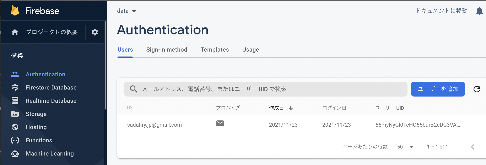
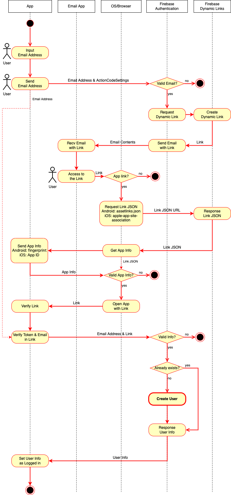

# FlutterFire MailLink Login Example


The flutter project example of MailLink Login by [FlutterFire](https://firebase.flutter.dev/).

※日本語の記事は[こちら](https://zenn.dev/sadahiroyoshi/articles/d3dc4e079889b0)

## Prerequisites
* [Create New Firebase Project](https://console.firebase.google.com/)

## Platform Setup
### Android
* [Generating a Firebase project configuration file](https://firebase.flutter.dev/docs/installation/android/#generating-a-firebase-project-configuration-file)
    * Package name must be `com.example.ff_maillink_login_example`
    * (For Dynamic Links) Set fingerprint of SHA-256
        * It can be generated by `android -> Tasks -> android -> signingReport`

### iOS

* [Generating a Firebase project configuration file](https://firebase.flutter.dev/docs/installation/ios/#generating-a-firebase-project-configuration-file)
    * Bundle ID must be `com.example.ffMaillinkLoginExample`
    * (For Dynamic Links) Set Team ID referring to [here](https://developer.apple.com/account/ios/profile/)
    * (For Dynamic Links) Set App Store ID as `999999999`
        * Any value is ok since this app won't be released. Set your own App Store ID after you release the app
* [Installing your Firebase configuration file](https://firebase.flutter.dev/docs/installation/ios/#installing-your-firebase-configuration-file)

## MailLink Setup

* [Configure Dynamic Links](https://firebase.google.com/docs/auth/web/passing-state-in-email-actions#configuring_firebase_dynamic_links)
    * The domain will be `{{the_domain_you_specified}}.page.link` if you won't use your own domain

* [Enable Email Link sign-in for your Firebase project](https://firebase.google.com/docs/auth/android/email-link-auth#enable_email_link_sign-in_for_your_firebase_project)

* Whitelist the domain `{{the_domain_you_specified}}.page.link` in authorized domains in `Authentication -> Sing-in method`

* Replace `ffloginexample.page.link` to `{{the_domain_you_specified}}.page.link` in this repo

* (For iOS) Replace `CBS798444Y` to `{{Team_ID_you_specified}}` in `ios/Runner/Info.plist`

## Usage

Just run.

```
$ flutter run
```

And input your **existing** email address on this app, then an email link will be sent to the address like below (may take a minutes).


Access the email link (e.g `data にログイン`) **on the device which has this app**. You will receive `Successfully signed in!` message.


* `Open link in app?` process is only when iOS. ([ref.](https://firebase.googleblog.com/2017/09/whats-new-with-firebase-dynamic-links.html))

And after `Successfully signed in!` message, the email link authenticated user will be created.



# Appendix

Image of the entire flow of MailLink Login.


